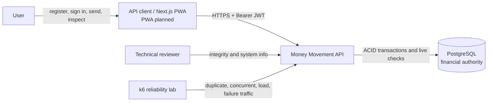
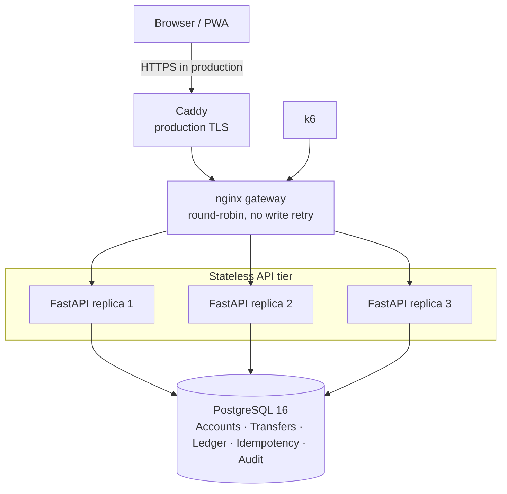
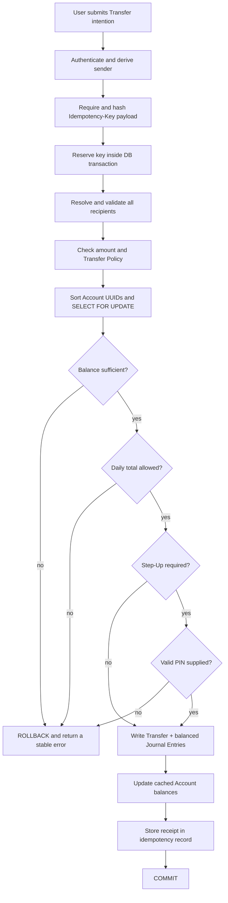
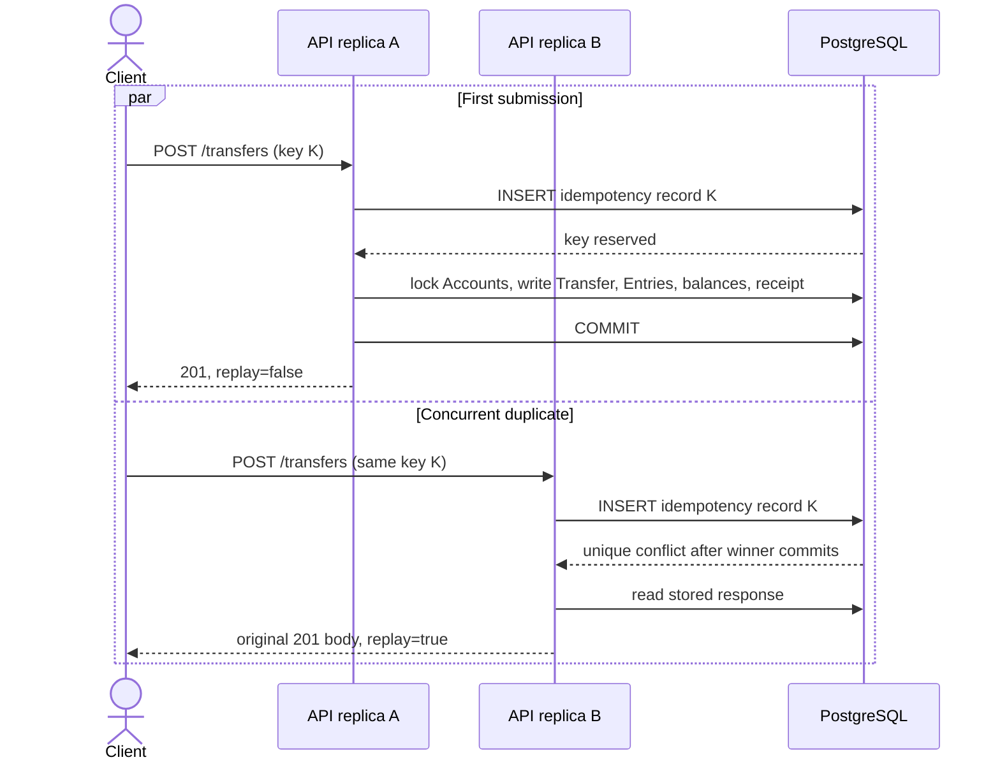
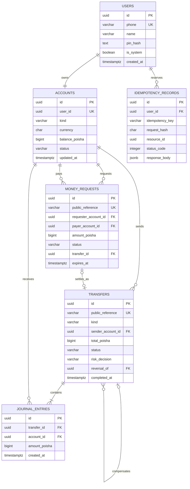
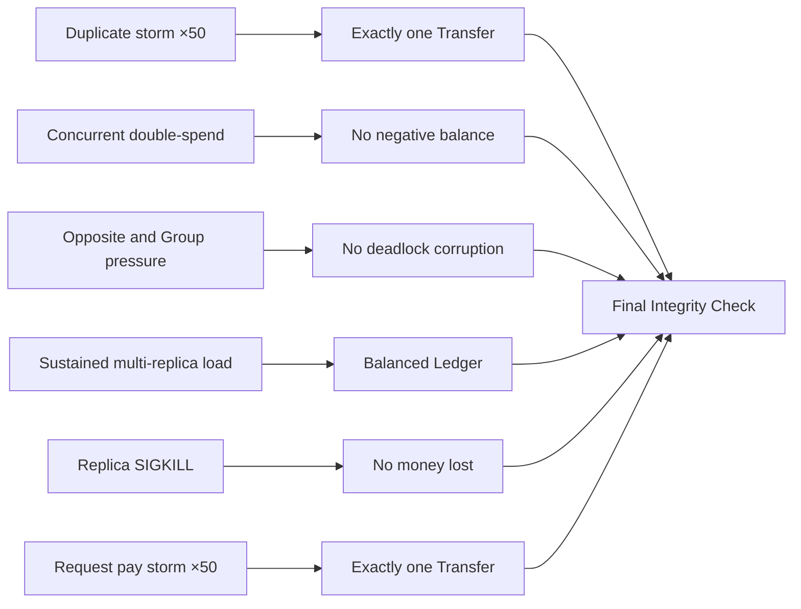
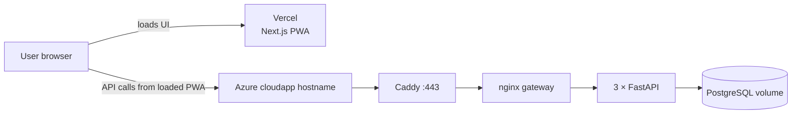

# Chorui

> A closed-loop, simulated BDT money platform built to prove that every taka moves atomically, exactly once, and remains auditable under retries, concurrency, and application failure.

[Five-minute setup](#run-locally) · [Codebase tour](docs/codebase-tour.md) · [API contract](docs/api-contract.md) · [Frontend integration](docs/frontend-integration.md) · [Reliability guide](docs/testing-and-reliability.md)

## Table of contents

- [Overview](#overview)
- [Project status](#project-status)
- [Why this project exists](#why-this-project-exists)
- [Core guarantees](#core-guarantees)
- [Feature scope](#feature-scope)
- [System architecture](#system-architecture)
- [Money movement design](#money-movement-design)
- [Data model](#data-model)
- [Technology choices](#technology-choices)
- [API specification](#api-specification)
- [Run locally](#run-locally)
- [Test and demonstrate reliability](#test-and-demonstrate-reliability)
- [Configuration](#configuration)
- [Production deployment](#production-deployment)
- [Security model](#security-model)
- [Observability and integrity](#observability-and-integrity)
- [UI and diagram showcase templates](#ui-and-diagram-showcase-templates)
- [Repository guide](#repository-guide)
- [Roadmap and known limitations](#roadmap-and-known-limitations)
- [Contributing](#contributing)

## Overview

Money Movement is a deliberately small financial system with a deeply engineered core. A User registers with a Bangladeshi mobile number and receives a simulated **৳100,000** grant. They can then send money to one or several registered Users, inspect their Account and Transfer history, and independently check that the Ledger remains internally consistent.

The application is not a bank, payment gateway, blockchain, or production mobile financial service. It integrates with no real payment rail and holds no real money. Its purpose is to demonstrate the engineering properties that a trustworthy money system needs:

- atomic Transfers with no partial outcome;
- exactly-once business effects across duplicate requests;
- concurrency-safe balance and daily-limit checks;
- immutable, balanced Journal Entries;
- deterministic and explainable policy decisions;
- stateless API replicas with PostgreSQL as the sole financial authority;
- live reconciliation after normal traffic and deliberate failures.

All authoritative amounts are integers in **poisha**. One taka is 100 poisha, so `250000` represents **৳2,500.00**. Decimal taka values never enter the Ledger.

## Project status

**Current state as of 29 August 2026:** the backend financial core, responsive Next.js PWA, Smart Wallet cash-inventory interface, shared-expense settlement, deterministic Financial Outlook, the judge-facing operations console, the local multi-replica stack, the scheduler worker, and the k6 reliability scenarios are implemented. The proof harness assembles a measured report from a full scenario pass. Azure resources and Caddy configuration are prepared; the final remote deployment, Vercel environment, and real-phone verification remain operational follow-up work.

| Area | Status | Notes |
|---|---|---|
| Registration, login, JWT authentication | Implemented | Includes atomic signup grant and persistent login lockout |
| Account balance and recipient lookup | Implemented | Recipient responses expose only name and masked phone |
| One-to-one Transfer | Implemented | Atomic, idempotent, policy-checked, and ledger-backed |
| Group Transfer | Implemented | Up to 20 submitted recipients; all recipients commit or none do |
| Transfer history and detail | Implemented | Read from the requesting Account's Journal Entries |
| Deterministic Step-Up rules | Implemented | Amount, first-recipient, and velocity rules |
| Integrity report | Implemented | Five live, uncached financial assertions |
| Three API replicas and nginx gateway | Implemented | Local Docker Compose topology |
| k6 reliability laboratory | Verified | Six scenarios pass against a clean three-replica stack |
| Next.js PWA and operations console UI | Implemented | 22 routes; typed API seam, responsive consumer shell, and a live judge-facing console in both themes |
| Money Requests | Implemented | Create, list, inspect, pay, decline, cancel, expiry, and concurrent-payment safety |
| Consent-based Reversals | Implemented | Approval creates a compensating Transfer; original Journal Entries remain immutable |
| Notifications | Implemented | Same-transaction writes, private unread state, and 10-second frontend polling |
| Scheduled Transfers | Implemented | PIN-authorized intentions claimed once and executed by the normal Transfer engine |
| Smart Wallet | Implemented | Separate append-only physical-cash inventory with explicit reconciliation |
| Smart Group Settlement | Implemented | Immutable expenses, explainable net positions, and per-payer consent |
| Financial Outlook | Implemented | Read-only integer-poisha analytics over completed Journal Entries; no write path and no score |
| Operations metrics endpoint | Implemented | `GET /system-metrics` reads database, throughput, and concurrency behaviour live |
| Retention sweeps | Implemented | The scheduler purges expired idempotency records and rate-limit counters in bounded batches |
| Proof harness | Implemented | One command runs the scenarios, snapshots PostgreSQL either side of each, and renders [docs/PROOF.md](docs/PROOF.md) |
| Production HTTPS deployment | Prepared | Compose, Caddy, and Azure instructions exist; final verification is pending |

Do not describe planned features as shipped. The implementation tracker in [tasks/todo.md](tasks/todo.md) is the detailed source for current scope.

## Why this project exists

The design starts from one question:

> How can a User and a technical reviewer know that no money was duplicated, lost, partially moved, or silently corrupted?

The answer is a narrow product surface backed by independently checkable invariants. The frontend may eventually offer several ways to form an intention—direct Send, Group Send, a paid Money Request, or a consent-based Reversal—but only one service is allowed to turn that intention into a financial effect.

### Domain language

The project uses precise terms consistently:

| Term | Meaning |
|---|---|
| **User** | A person with credentials who can authenticate and act |
| **Account** | The BDT holding owned by exactly one User |
| **Issuance Account** | The single system Account from which signup grants are debited |
| **Transfer** | One completed, atomic movement from one Account to one or more Accounts |
| **Journal Entry** | One immutable signed debit or credit leg of a Transfer |
| **Ledger** | The complete set of Journal Entries; the financial truth |
| **Group Transfer** | One all-or-nothing Transfer with multiple recipients |
| **Transfer Policy** | Deterministic limits applied before money may move |
| **Step-Up** | An additional PIN challenge triggered by an explainable risk rule |
| **Integrity Check** | Live assertions proving that Ledger and Account state agree |
| **Receipt** | The durable User-facing representation of a completed Transfer |

See [CONTEXT.md](CONTEXT.md) for the complete vocabulary and terms deliberately avoided.

## Core guarantees

### Financial invariants

Every successful commit preserves these rules:

1. **Money is conserved.** The signed sum of all Journal Entries is zero.
2. **Every Transfer balances.** Each completed Transfer has at least two Journal Entries whose sum is zero.
3. **User Accounts never go negative.** Application checks and a PostgreSQL `CHECK` constraint both enforce this.
4. **Balances are explainable.** Each cached Account balance equals the sum of its Journal Entries.
5. **Issuance mirrors holdings.** The negative Issuance Account balance exactly offsets all User holdings.
6. **Journal Entries are append-only.** PostgreSQL rejects `UPDATE` and `DELETE` operations with a trigger.
7. **A Group Transfer is atomic.** An invalid recipient or insufficient total balance rejects the whole group.
8. **A duplicate intention moves money once.** The idempotency result commits in the same transaction as the money.

### Operational principles

- **Fail closed:** when PostgreSQL cannot authorize a movement, no money moves.
- **Backend-derived identity:** the bearer token determines the sender; request bodies cannot name one.
- **Single authority:** PostgreSQL is authoritative; client caches and future queues may never approve a Transfer.
- **No offline sending:** cached reads may be shown as stale, but a Transfer is never queued for later replay.
- **Explainable risk:** deterministic rules—not AI—decide whether Step-Up is required.
- **No silent proxy retry:** nginx never replays a money-changing request onto another replica.

## Feature scope

### Implemented product behavior

- Register with a normalized Bangladeshi phone number, name, and five-digit PIN.
- Atomically create the User, Account, signup grant Transfer, balanced Journal Entries, and audit event.
- Login using a bcrypt-hashed PIN and receive a 12-hour JWT.
- Lock a caller-specific login subject after five failed attempts within 15 minutes.
- Read the authenticated Account balance with an `asOf` timestamp.
- Verify a recipient by full name and masked phone without exposing IDs or balances.
- List up to six recent recipients.
- Send a one-to-one or Group Transfer with an `Idempotency-Key`.
- Create, list, pay, decline, and cancel 24-hour Money Requests.
- Enforce per-Transfer and Dhaka-calendar-day limits.
- Require Step-Up for large, first-time, or high-velocity Transfers.
- Read signed sent/received history and a reference-addressed Transfer detail.
- Query liveness, database readiness, live policy, observed replicas, and Ledger integrity.
- Raise a consent-based Reversal request against a completed Transfer, which the original recipient may approve or decline.
- Write in-app Notifications in the same transaction as the state change they describe, and read them by polling.
- Authorize a Scheduled Transfer with a PIN and let the worker execute it later through the normal Transfer engine.
- Record physical cash observations in a separate append-only Cash Inventory Journal and reconcile against a counted total.
- Split shared expenses, compute an explainable net position per member, and settle only the signed-in payer's own obligations.
- Read a deterministic Financial Outlook derived from completed Journal Entries, with every rule and formula disclosed.
- Enforce shared login/lookup/request rate limits, request-size bounds, and replica heartbeats.
- Read live database, throughput, concurrency, and per-replica latency metrics from the operations console.

### Explicit non-goals

- Real BDT, cash-in/cash-out, bank, card, MFS, or merchant integration
- KYC, AML, regulatory reporting, disputes, or production fraud detection
- Multi-currency accounting
- Blockchain or event-sourced consensus
- Multi-region or multi-writer databases
- Kubernetes, Kafka, or microservices for the current prototype
- Claims of nationwide scale or database high availability

## System architecture

### System context



### Runtime architecture



In local development, nginx is published at `http://localhost:8080` and PostgreSQL at `localhost:5433`. In the production design, only Caddy publishes ports 80 and 443; PostgreSQL, nginx, and the API replicas remain on the internal Compose network.

### Component responsibilities

| Component | Responsibility | Must not do |
|---|---|---|
| Router layer | HTTP parsing, authentication dependency, response shape, rejection auditing | Move balances directly |
| `services/transfer.py` | Resolve recipients, enforce policy, lock Accounts, orchestrate one atomic Transfer | Commit outside its caller's transaction |
| `services/ledger.py` | Create Transfer and Journal Entry rows, update cached balances, acquire ordered locks | Accept unbalanced legs |
| `services/money_requests.py` | Own request lifecycle and delegate payment to the Transfer service | Create a second money path |
| `idempotency.py` | Reserve a per-User key and store/replay the committed response | Guess an uncertain result |
| `policy.py` | Apply amount, daily, and deterministic Step-Up rules | Use an opaque model |
| `services/integrity.py` | Compute live reconciliation assertions and counters | Cache a verdict |
| `services/system_metrics.py` | Read database, throughput, and concurrency behaviour from PostgreSQL on demand | Present an application-held counter as database truth |
| `observability.py` | Hold this replica's bounded latency ring and label it with the instance id | Let a per-process number be read as system-wide |
| `services/retention.py` | Purge expired idempotency records and rate-limit counters in bounded batches | Touch Journal Entries or audit events |
| `workers/scheduler.py` | Claim one due Scheduled Transfer at a time and run the periodic retention sweep | Move money outside `services/transfer.py` |
| PostgreSQL | Own locks, constraints, durable state, and append-only enforcement | Delegate authority to a client cache |
| nginx | Distribute requests and expose the upstream address | Silently retry a POST |
| Caddy | Terminate production TLS and manage certificates | Own financial routing rules |

## Money movement design

### Transfer data flow



All database writes from `reserve` through `receipt` share one transaction. A failure before commit leaves neither a partial movement nor a consumed idempotency key.

### Exactly-once business effect



The uniqueness constraint is `(user_id, idempotency_key)`. Reusing the same key with a different payload returns `409 IDEMPOTENCY_KEY_REUSED`. The PIN is excluded from the fingerprint so a Step-Up resubmission is the same intention and must reuse the same key.

### Concurrency control

Before reading an authoritative balance, the engine gathers every Account touched by the Transfer, removes duplicates, sorts UUIDs ascending, and locks the rows in that global order with `SELECT ... FOR UPDATE`.

This provides:

- serialization of competing spends from the same Account;
- a fresh balance read after the lock, not before it;
- a daily-limit check protected by the same sender lock;
- structural deadlock prevention for opposite-direction and Group Transfers;
- a 3-second lock timeout as a fail-fast backstop, with no deadlock retry loop hiding an ordering defect.

### Transfer Policy and Step-Up rules

| Rule | Default | Outcome |
|---|---:|---|
| Amount must be positive | `> 0` poisha | Otherwise `INVALID_AMOUNT` |
| Per-Transfer maximum | ৳100,000 | Otherwise `TRANSFER_LIMIT_EXCEEDED` |
| Per-day send maximum | ৳200,000, reset at Dhaka midnight | Otherwise `TRANSFER_LIMIT_EXCEEDED` |
| Group recipient maximum | 20 submitted recipients | Request validation or policy rejection |
| Large Transfer Step-Up | ≥ ৳25,000 | PIN required |
| First-time recipient | Any amount | PIN required |
| Velocity Step-Up | ≥ 5 Transfers in 10 minutes | PIN required |

The first matching Step-Up rule wins, and its human-readable reason is returned to the client and persisted on the completed Transfer.

## Data model

### Entity-relationship diagram



`AUDIT_EVENTS` is intentionally generic and is omitted from the relationship lines because its actor and resource fields are not database foreign keys. It records replica starts, authentication outcomes, completed Transfers, idempotent replays, and durable rejection counters.

### Ledger example

A ৳2,500 one-to-one Transfer produces two signed entries:

| Account | `amount_poisha` | Interpretation |
|---|---:|---|
| Sender | `-250000` | Debit ৳2,500.00 |
| Recipient | `250000` | Credit ৳2,500.00 |
| **Sum** | **`0`** | **Balanced** |

A Group Transfer produces one sender debit and one credit per unique recipient. Duplicate recipient phones are merged only after every submitted amount has been confirmed positive.

### Schema strategy

[backend/app/schema.sql](backend/app/schema.sql) is authoritative and re-runnable. Each API replica applies it at startup under one PostgreSQL advisory lock, so only one replica performs schema work at a time. Raw SQL was chosen over an ORM model layer and Alembic for the hackathon's compact, inspectable scope; a production evolution should introduce versioned, reviewed migrations before independently deploying schema changes.

## Technology choices

| Choice | Why it fits | Trade-off accepted |
|---|---|---|
| **FastAPI + Pydantic** | Typed HTTP boundary, generated OpenAPI, concise validation | Synchronous handlers occupy a worker during database calls |
| **SQLAlchemy Core-style SQL** | Explicit transactions and locking are visible to reviewers | Less abstraction and fewer migration conveniences than a full ORM |
| **PostgreSQL 16** | ACID commits, row locks, constraints, JSONB audit metadata, advisory locks | Current deployment has one writer and no automatic database failover |
| **Double-entry Ledger + cached balance** | Fast balance reads plus an independent reconciliation source | Two representations must update atomically and be checked for drift |
| **Pessimistic row locking** | Correct overspend prevention under concurrent writes | Conflicting Transfers wait and may hit the bounded lock timeout |
| **Database-backed idempotency** | Correct across replicas, restarts, and concurrent duplicates | Records are retained for 48 hours, so a duplicate arriving later than that is treated as a new intention |
| **Three stateless API replicas** | Demonstrates horizontal application scaling and process-failure tolerance | Does not make the single database highly available |
| **nginx** | Simple replica distribution and explicit no-retry policy for writes | Health is connection-based rather than orchestrator-driven service discovery |
| **Caddy in production** | Automatic TLS for the Azure hostname | Adds a second proxy with a deliberately separate responsibility |
| **Docker Compose** | Reproducible, judge-friendly local and VM topology | Not a production orchestrator |
| **k6** | Executable concurrency and failure claims with non-zero thresholds | Scenarios prove correctness at prototype load, not nationwide capacity |
| **Next.js PWA on Vercel** | Planned mobile-first experience, CDN, simple push deploy | Split origin requires TLS, CORS, and bearer-token handling |
| **Deterministic risk rules** | Explainable and easy to test | Less adaptive than a mature fraud platform; intentionally no AI in the money path |
| **Connection pool sized against the request thread pool** | Pool exhaustion is structurally impossible rather than merely unlikely | Caps concurrent in-flight requests per replica at a number chosen rather than inherited |
| **Live operational metrics, no metrics store** | Every figure on the console is a PostgreSQL read at the moment of the call | No history beyond what the database itself retains; no Prometheus or Grafana |
| **Per-replica latency in process memory** | Measuring the hot path costs the hot path nothing | The percentile is one replica's recent traffic, not a system figure, and is labelled as such |

The architectural decisions and their consequences are recorded in [docs/adr](docs/adr):

1. [Double-entry Journal with cached balances](docs/adr/0001-double-entry-journal-with-cached-balance.md)
2. [Atomic Group Transfers](docs/adr/0002-group-transfers-are-atomic.md)
3. [Deterministic lock ordering](docs/adr/0003-deterministic-lock-ordering.md)
4. [No offline Transfer queueing](docs/adr/0004-no-offline-transfer-queueing.md)
5. [Consent-based compensating Reversals](docs/adr/0005-reversal-is-consent-based-compensation.md)
6. [No AI in the money path](docs/adr/0006-no-ai-in-the-money-path.md)
7. [Split-origin deployment](docs/adr/0007-split-origin-deployment.md)
8. [Physical cash uses a separate inventory journal](docs/adr/0008-separate-cash-inventory-journal.md)
9. [Group settlement preserves per-payer consent](docs/adr/0009-group-settlement-preserves-per-payer-consent.md)
10. [Scheduled intentions execute through the Transfer engine](docs/adr/0010-scheduled-intentions-execute-through-transfer-engine.md)
11. [Financial Outlook is deterministic and non-authoritative](docs/adr/0011-financial-outlook-is-deterministic-and-non-authoritative.md)

## API specification

Base URL: `http://localhost:8080/api/v1`

Interactive OpenAPI documentation: `http://localhost:8080/api/v1/docs`

### Conventions

- Send `Authorization: Bearer <jwt>` except for registration, login, liveness, readiness, integrity, and system info.
- Send a stable `Idempotency-Key` on Transfer creation, Money Request creation, and payment; reuse it when retrying the same intention.
- Requests accept camelCase and snake_case aliases where defined. Responses use camelCase.
- Amounts are integer poisha.
- The authenticated token determines the sender.
- All errors use `{ "error": { "code", "message", "traceId" } }`.
- `X-Trace-Id` and `X-Instance` identify the request and API process.
- `X-Served-By` identifies the nginx upstream; `X-Idempotent-Replay` identifies Transfer replays.

### Endpoint summary

| Method | Route | Auth | Purpose |
|---|---|---:|---|
| `POST` | `/auth/register` | No | Register and atomically issue the signup grant |
| `POST` | `/auth/login` | No | Authenticate and receive a JWT |
| `GET` | `/auth/me` | Yes | Read the authenticated User |
| `GET` | `/accounts/me` | Yes | Read authoritative balance and `asOf` |
| `GET` | `/users/lookup?phone=...` | Yes | Recipient Verification data |
| `GET` | `/users/recent-recipients` | Yes | Read up to six recent recipients |
| `POST` | `/transfers` | Yes | Commit a one-to-one or Group Transfer |
| `GET` | `/transfers` | Yes | List signed Account history; optional direction filter |
| `GET` | `/transfers/{reference}` | Yes | Read one visible Transfer detail |
| `POST` | `/money-requests` | Yes | Create a 24-hour request for payment |
| `GET` | `/money-requests` | Yes | List incoming/outgoing requests by lifecycle status |
| `GET` | `/money-requests/{id}` | Yes | Read one authorized request |
| `POST` | `/money-requests/{id}/pay` | Yes | Settle through the normal Transfer engine |
| `POST` | `/money-requests/{id}/decline` | Yes | Payer declines a pending request |
| `POST` | `/money-requests/{id}/cancel` | Yes | Requester cancels a pending request |
| `GET` | `/health/live` | No | Check the API process without touching PostgreSQL |
| `GET` | `/health/ready` | No | Check that the API can reach PostgreSQL |
| `GET` | `/integrity` | No | Run five live financial assertions |
| `GET` | `/system-info` | No | Read live policy and fresh replica heartbeats |

### Minimal request examples

Register a User:

```bash
curl -X POST http://localhost:8080/api/v1/auth/register \
  -H "Content-Type: application/json" \
  -d '{"name":"Ayesha Rahman","phone":"01712345678","pin":"48213"}'
```

Create a one-to-one Transfer:

```bash
curl -X POST http://localhost:8080/api/v1/transfers \
  -H "Authorization: Bearer <jwt>" \
  -H "Idempotency-Key: <uuid-v4>" \
  -H "Content-Type: application/json" \
  -d '{"recipientPhone":"01812345678","amountPoisha":250000,"note":"Lunch"}'
```

Create an atomic Group Transfer:

```bash
curl -X POST http://localhost:8080/api/v1/transfers \
  -H "Authorization: Bearer <jwt>" \
  -H "Idempotency-Key: <uuid-v4>" \
  -H "Content-Type: application/json" \
  -d '{"recipients":[{"phone":"01812345678","amountPoisha":100000},{"phone":"01912345678","amountPoisha":150000}],"note":"Trip split"}'
```

The first Transfer to a recipient normally returns `403 STEP_UP_REQUIRED`. Resubmit the same body with `"pin":"48213"` and the **same** `Idempotency-Key`.

For complete payloads, responses, error codes, and idempotency semantics, use [docs/api-contract.md](docs/api-contract.md) as the API source of truth.

## Run locally

### Prerequisites

- Docker Engine or Docker Desktop with Compose v2
- Approximately 4 GB of free memory for PostgreSQL, three API replicas, and the gateways/tests
- Free local ports `8080` and `5433`; port `3000` is reserved for the future web profile
- Git for cloning the repository

### Start the backend stack

```bash
git clone https://github.com/Rockstatata/pstu-hackathon.git
cd pstu-hackathon
docker compose up -d --build
docker compose ps
```

Compose starts:

- PostgreSQL 16 with a persistent `dbdata` volume;
- three FastAPI replicas;
- nginx on `http://localhost:8080`.

Verify the system:

```bash
curl http://localhost:8080/api/v1/health/live
curl http://localhost:8080/api/v1/health/ready
curl http://localhost:8080/api/v1/integrity
```

Then open `http://localhost:8080/api/v1/docs` for an interactive workflow.

### Useful development commands

```bash
# Follow all API replica logs
docker compose logs -f api

# Rebuild after dependency or image changes
docker compose up -d --build

# Stop containers while preserving PostgreSQL data
docker compose down

# Start an empty, ephemeral three-replica test stack on port 18080
docker compose -f docker-compose.test.yml up -d --build --wait
```

The optional `web` profile is reserved for the Next.js application. It cannot be built until `web/` contains that application.

## Test and demonstrate reliability

### Backend regressions

The regression suite uses real PostgreSQL because mocks cannot prove locking, idempotency, rollback, daily-policy, or concurrency behavior.

```bash
docker compose exec -T api python -m unittest discover -s tests -v
docker compose -f docker-compose.test.yml --profile verify run --rm acceptance
```

Money-path changes must add a regression at the real seam and finish with:

```bash
curl http://localhost:8080/api/v1/integrity
```

### k6 failure laboratory



Run one local scenario:

```bash
docker compose --profile chaos run --rm k6 run /scripts/01-duplicate-storm.js
```

Available scenarios:

| Scenario | Claim under test | Primary proof |
|---|---|---|
| `01-duplicate-storm.js` | 50 identical concurrent submissions have one financial effect | One Transfer plus idempotent replays |
| `02-double-spend.js` | Concurrent spends cannot overdraw one Account | Allowed successes, correct rejections, final zero balance |
| `03-deadlock-pressure.js` | Opposite and Group traffic obey global lock ordering | No corruption or deadlock failure |
| `04-sustained-load.js` | All three stateless replicas can serve sustained traffic | Multiple instances observed and final Ledger healthy |
| `05-replica-kill.js` | Killing an API process does not lose committed money | Pool total unchanged and final Ledger healthy |
| `06-money-request-payment-storm.js` | Different-key concurrent pays settle once | One Transfer and 49 terminal conflicts |

Each script uses k6 thresholds and exits non-zero when its claimed invariant fails. Read [tests/k6/README.md](tests/k6/README.md) before presenting results; it documents prerequisites, expected Step-Up handling, and what these tests do **not** prove.

### Suggested judge/demo sequence

1. Register two Users and show the balanced issuance legs.
2. Complete a normal Transfer and show the Receipt/reference.
3. Replay one `Idempotency-Key` concurrently and show one movement.
4. Run the double-spend scenario and show correct insufficient-funds rejections.
5. Show traffic reaching multiple API instances.
6. Kill one API replica during traffic.
7. Finish on `/api/v1/integrity` with every assertion passing.

## Configuration

FastAPI settings are environment-driven. Development defaults are safe only for local simulation.

| Variable | Development default | Purpose |
|---|---|---|
| `DATABASE_URL` | `postgresql+psycopg://money:money@db:5432/money` | PostgreSQL connection string |
| `JWT_SECRET` | `dev-secret-not-for-production` | JWT signing key; required secret in production |
| `JWT_ALGORITHM` | `HS256` | JWT signing algorithm |
| `JWT_TTL_HOURS` | `12` | Token lifetime |
| `LOCK_TIMEOUT_MS` | `3000` | Fail-fast row-lock timeout |
| `CORS_ORIGINS` | `http://localhost:3000` | Comma-separated allowed frontend origins |
| `SIGNUP_GRANT_POISHA` | `10000000` | ৳100,000 simulated grant |
| `MAX_TRANSFER_POISHA` | `10000000` | ৳100,000 per-Transfer maximum |
| `MAX_DAILY_SEND_POISHA` | `20000000` | ৳200,000 Dhaka-day maximum |
| `MAX_GROUP_RECIPIENTS` | `20` | Maximum submitted Group recipients |
| `STEPUP_AMOUNT_POISHA` | `2500000` | ৳25,000 Step-Up threshold |
| `STEPUP_VELOCITY_COUNT` | `5` | Transfer count that triggers velocity Step-Up |
| `STEPUP_VELOCITY_MINUTES` | `10` | Velocity lookback window |
| `EXPECTED_REPLICAS` | `3` | Healthy replica target reported by `/system-info` |
| `HEARTBEAT_FRESHNESS_SECONDS` | `15` | Maximum age counted as healthy |
| `CHAOS_ENABLED` | `false` | Enables the rollback laboratory outside production only |

Production Compose additionally requires `POSTGRES_USER`, `POSTGRES_PASSWORD`, `POSTGRES_DB`, `PUBLIC_HOSTNAME`, and `ACME_EMAIL`. Never reuse or commit development secrets.

## Production deployment

The intended topology places the Next.js PWA on Vercel and the financial stack on one Azure VM:



Build and start the standalone production file on the VM:

```bash
docker compose -f docker-compose.prod.yml up -d --build
```

Production properties:

- Caddy obtains and renews the public TLS certificate.
- nginx owns round-robin distribution and disables upstream replay.
- three one-worker API containers are stateless.
- PostgreSQL has no published host port.
- the API image has no source bind mount and no auto-reload.
- persistent database and Caddy volumes survive container replacement.

Follow the complete provisioning, secret setup, Vercel, verification, redeployment, and teardown runbook in [infra/azure/DEPLOY.md](infra/azure/DEPLOY.md).

## Security model

### Implemented controls

- PINs are bcrypt-hashed; plaintext PINs are neither persisted nor logged.
- Invalid phone and invalid PIN login attempts have the same response and both perform bcrypt work.
- Failed login limits are persisted in PostgreSQL and keyed by phone plus forwarded client address.
- PostgreSQL-backed rate limits apply across replicas; forwarded addresses are parsed and trusted only from configured proxy networks.
- JWTs are signed, expire after 12 hours by default, and determine the acting User.
- The sender Account is resolved server-side and cannot be supplied in a Transfer body.
- Recipient lookup exposes no User ID, Account ID, balance, or full stored phone number.
- Transfer references not involving the caller return `404`, avoiding an existence oracle.
- Journal mutability and negative User balances are rejected at the database layer.
- CORS names the accepted and exposed financial headers explicitly.
- Unhandled errors return a trace ID and no stack trace.
- Request bodies are capped at 32 KiB and structured logs exclude bodies, JWTs, PINs, and hashes.
- Authoritative storage failure fails closed.

### Prototype boundaries

This is not a production security certification. Before real-world use it would need, at minimum, managed secrets, key rotation, stronger identity/device controls, adaptive abuse monitoring, security headers, encrypted backups, database high availability, disaster recovery, dependency scanning, external penetration testing, and regulatory review.

## Observability and integrity

Every response carries a trace and instance identity. The gateway adds its selected upstream, write responses state whether they are an idempotent replay, and every request emits one redacted JSON log. Replica heartbeats update every five seconds and are healthy for a 15-second freshness window.

`GET /api/v1/integrity` computes these five assertions directly from PostgreSQL on every request:

| Assertion | Healthy value |
|---|---:|
| Global sum of signed Journal Entries | `0` |
| Accounts whose cached balance differs from their Journal sum | `0` |
| User Accounts with negative balances | `0` |
| Transfers with fewer than two or unbalanced Journal Entries | `0` |
| Difference between Issuance and total User holdings | `0` |

The report also derives durable counters for completed Transfers, idempotent replays, rejected overspends, Step-Ups, policy rejections, registered Users, and Journal Entries. `HEALTHY` means all five assertions currently pass; it is a financial consistency verdict, not a claim that every production dependency is highly available.

## UI and diagram showcase templates

The templates below provide a consistent structure for adding screenshots and exported diagrams without inventing results that do not yet exist. Create assets under `docs/assets/` when the corresponding UI or presentation artifact is ready.

### UI demonstration gallery

| Flow | Recommended capture | Asset placeholder | Caption/result |
|---|---|---|---|
| Registration | Mobile registration plus funded welcome state | `docs/assets/ui/01-registration.png` | _Add grant and validation outcome_ |
| Dashboard | Balance, quick actions, and recent Transfers | `docs/assets/ui/02-dashboard.png` | _Add viewport and data state_ |
| Recipient Verification | Full name, masked phone, amount, and deliberate confirm action | `docs/assets/ui/03-recipient-verification.png` | _Add the human-error safeguard demonstrated_ |
| Step-Up | PIN prompt with the exact deterministic reason | `docs/assets/ui/04-step-up.png` | _Add the rule that triggered_ |
| Receipt | Amount, recipient, reference, timestamp, and status | `docs/assets/ui/05-receipt.png` | _Add the completed Transfer reference_ |
| Group Transfer | Every recipient, each amount, and total | `docs/assets/ui/06-group-transfer.png` | _Add the atomic outcome_ |
| History | Signed sent/received entries and detail view | `docs/assets/ui/07-history.png` | _Add filter/state shown_ |
| Integrity dashboard | Projector-readable verdict, assertions, and counters | `docs/assets/ui/08-integrity.png` | _Add test run associated with the verdict_ |
| Responsive comparison | 390 px, 768 px, and 1440 px views | `docs/assets/ui/09-responsive.png` | _Add devices/browsers tested_ |
| Offline state | Stale timestamp and disabled money actions | `docs/assets/ui/10-offline.png` | _Add the no-queue behavior_ |

Suggested Markdown after adding a capture:

```markdown
<p align="center">
  
</p>
<p align="center"><em>Recipient Verification prevents a correct amount from reaching the wrong person.</em></p>
```

### Diagram asset register

The Mermaid diagrams in this README are the editable source. If a deck, report, or renderer needs static assets, export them using this naming plan:

| Diagram | Source in this README | Export placeholder | Review note |
|---|---|---|---|
| System context | `System architecture → System context` | `docs/assets/diagrams/01-system-context.svg` | Show people and external boundaries |
| Runtime architecture | `System architecture → Runtime architecture` | `docs/assets/diagrams/02-runtime-architecture.svg` | Keep financial authority visually explicit |
| Transfer data flow | `Money movement design → Transfer data flow` | `docs/assets/diagrams/03-transfer-data-flow.svg` | Mark all rollback branches |
| Idempotency sequence | `Money movement design → Exactly-once business effect` | `docs/assets/diagrams/04-idempotency-sequence.svg` | Show concurrent replicas and stored replay |
| Entity relationship | `Data model → Entity-relationship diagram` | `docs/assets/diagrams/05-er-diagram.svg` | Regenerate after every schema change |
| Deployment topology | `Production deployment` | `docs/assets/diagrams/06-deployment.svg` | Distinguish Vercel and Azure trust boundaries |
| Reliability coverage | `Test and demonstrate reliability` | `docs/assets/diagrams/07-reliability-coverage.svg` | Attach an actual k6 run identifier |

Blank record for any additional diagram:

```markdown
### <Diagram title>

**Purpose:** <What question this diagram answers>

**Scope:** <Included and excluded components>

**Source of truth:** <Code, schema, ADR, or API document>

**Last verified:** <YYYY-MM-DD / commit SHA>

<!-- Add Mermaid source here, or link docs/assets/diagrams/<name>.svg -->
```

## Repository guide

```text
.
├── backend/
│   ├── app/
│   │   ├── routers/            # HTTP boundary
│   │   ├── services/
│   │   │   ├── transfer.py     # sole User money-moving path
│   │   │   ├── ledger.py       # Journal Entry and balance writer
│   │   │   └── integrity.py    # live reconciliation
│   │   ├── schema.sql          # authoritative, re-runnable schema
│   │   ├── idempotency.py      # exactly-once request guard
│   │   └── policy.py           # limits and deterministic Step-Up
│   └── tests/                  # real-PostgreSQL regressions and OpenAPI drift
├── tests/blackbox/             # public three-replica acceptance gate
├── tests/k6/                   # six concurrency and failure scenarios
├── infra/
│   ├── nginx/                  # replica gateway
│   ├── caddy/                  # production TLS edge
│   └── azure/                  # VM deployment runbook
├── docs/
│   ├── adr/                    # architectural decision records
│   ├── api-contract.md         # complete HTTP contract
│   ├── openapi.json            # deterministic frontend snapshot
│   ├── codebase-tour.md        # plain-language implementation map
│   ├── backend-architecture.md # locking, transactions, failure semantics
│   ├── frontend-integration.md # frontend workflow and retry rules
│   ├── testing-and-reliability.md # commands, evidence, troubleshooting
│   └── frontend-screens.md     # PWA screen/component specification
├── web/                        # reserved for the planned Next.js PWA
├── CONTEXT.md                  # canonical domain language
├── docker-compose.yml          # local development stack
└── docker-compose.prod.yml     # standalone production stack
```

### Documentation map

| Document | Use it for |
|---|---|
| [CONTEXT.md](CONTEXT.md) | Canonical product vocabulary and definitions |
| [docs/api-contract.md](docs/api-contract.md) | Endpoint payloads, errors, headers, and retry semantics |
| [docs/codebase-tour.md](docs/codebase-tour.md) | Plain-language product and repository walkthrough |
| [docs/backend-architecture.md](docs/backend-architecture.md) | Technical module, transaction, locking, and operations design |
| [docs/frontend-integration.md](docs/frontend-integration.md) | Screen mapping, token/poisha handling, and safe retries |
| [docs/testing-and-reliability.md](docs/testing-and-reliability.md) | Test layers, verified evidence, and troubleshooting |
| [docs/frontend-screens.md](docs/frontend-screens.md) | Mobile-first screens, components, states, and accessibility rules |
| [docs/adr](docs/adr) | Architectural choices, alternatives, and consequences |
| [tests/k6/README.md](tests/k6/README.md) | Reliability scenario execution and interpretation |
| [infra/azure/DEPLOY.md](infra/azure/DEPLOY.md) | Azure VM, TLS, secrets, Vercel, and redeployment |
| [tasks/todo.md](tasks/todo.md) | Current implementation status and cut line |
| [docs/solution-prd](docs/solution-prd) | Original comprehensive product requirements and research rationale |

## Roadmap and known limitations

### Near-term product work

1. Build the mobile-first Next.js PWA and judge-facing Integrity dashboard.
2. Integrate the frontend branch against `docs/openapi.json` and hide deferred controls.
3. Implement consent-based Reversal requests as new compensating Transfers.
4. Add in-app notifications written atomically with relevant state changes.
5. Add scheduled intentions whose worker eventually calls the same Transfer engine.
6. Complete and capture the Azure/Vercel HTTPS deployment.

### Production evolution

- Replace startup-applied raw schema changes with versioned migrations.
- Add a transactional outbox for non-authoritative notifications and analytics.
- Introduce a highly available PostgreSQL topology, backups, point-in-time recovery, and tested restore procedures.
- Add read replicas or dedicated read models for history without moving write authority.
- Partition high-volume Ledger/history data when measured load justifies it.
- Add OpenTelemetry, metrics, centralized structured logs, alerts, and service-level objectives.
- Define idempotency and audit retention policies.
- Perform formal threat modeling and independent security review.

The intended scale story is horizontal stateless APIs around a consistent transaction authority—not a claim that the current single-VM prototype supports 10 million Users.

## Contributing

1. Read [CONTEXT.md](CONTEXT.md) and the relevant [ADRs](docs/adr) before changing domain behavior.
2. Keep every movement in `services/transfer.py` and every Journal Entry write in `services/ledger.py`.
3. Use integer poisha end to end; never introduce floating-point taka into authoritative state.
4. Add a real-PostgreSQL regression for money-path changes and run the final Integrity Check.
5. Keep API responses camelCase and preserve human-readable, stable error contracts.
6. Update the API contract, diagrams, ADRs, and implementation tracker when behavior changes.
7. Use focused Conventional Commits, for example `fix: reject invalid group amounts`.

A pull request should identify affected financial invariants; schema, locking, idempotency, authentication, and deployment implications; commands run; and UI screenshots where applicable.

## License

No license file is currently included. Unless the maintainers add one, the repository should not be assumed to grant reuse or redistribution rights.

---

<p align="center"><strong>Small surface area. One authoritative money path. Independently checkable integrity.</strong></p>
