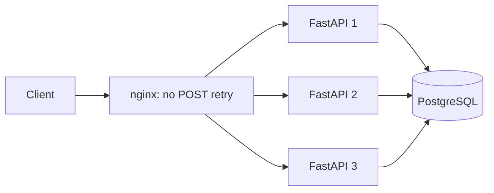
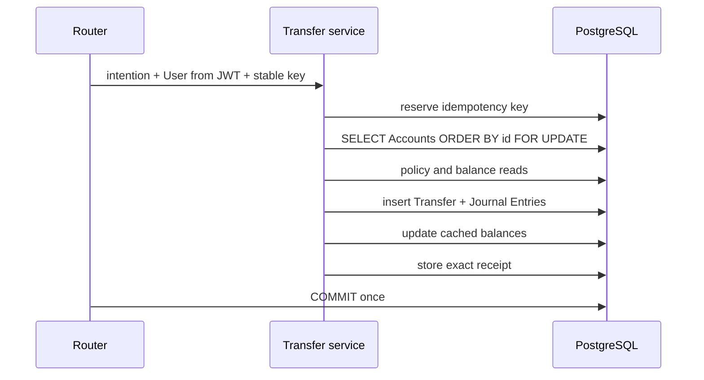

# Backend Architecture

## Authority and Module Boundaries

The backend is a synchronous FastAPI application replicated three times behind nginx. Replicas
are stateless; PostgreSQL owns identity, limits, lifecycle state, idempotency, locks, the Ledger,
and replica heartbeats.

Routers are shallow adapters. `transfer.execute()` is the deep financial interface: direct,
Group, and Money Request payment all enter there. `ledger.post()` is the only code allowed to
insert Journal Entries or update cached balances.

## Transaction and Locking Model

All touched Accounts are locked in ascending UUID order. This prevents circular waits instead of
retrying deadlocks. Balance and Dhaka-day policy checks happen after the sender lock. The Ledger
service rejects unbalanced legs; PostgreSQL rejects negative User balances and Journal Entry mutation.

Money Request payment first locks its request row. Only the payer can proceed; expiry and terminal
state are rechecked under that lock. It then calls the same Transfer service and links the resulting
Transfer before the shared commit. Different-key races therefore create at most one Transfer.

## Idempotency and Failure Semantics

`idempotency_records` has a unique `(user_id, idempotency_key)` constraint. Reservation and the
business effect share one transaction. Same-key/same-payload requests replay the stored status and
body; a changed payload returns 409. PIN is excluded from Transfer fingerprints so Step-Up retries
reuse the intention's key.

A database disconnect during commit has an uncertain outcome. The API and gateway return
`503 FINANCIAL_CORE_UNAVAILABLE` without claiming that money did not move. Clients must inspect
history and reuse the original key.

## Policy, Authentication, and Abuse Controls

JWT subject selects the acting User; request bodies never carry sender IDs. PIN verification uses
bcrypt for both present and absent Users to reduce login enumeration timing. Five failed PINs per
phone/client subject lock further attempts for 15 minutes.

PostgreSQL UPSERT counters enforce login (20/IP/minute), lookup (60/User/minute), and Money Request
creation (20/User/minute) across replicas. Forwarded addresses are accepted only from configured
proxy networks and must parse as IP addresses. Bodies are capped at 32 KiB; collection and query
limits are bounded at validation.

## Operations

Every request emits one JSON log with time, instance, trace, authenticated User when known,
operation, status, result, and latency. Bodies, JWTs, PINs, hashes, and secrets are never logged.

Each replica UPSERTs a heartbeat every five seconds. `/system-info` counts rows newer than 15
seconds and reports expected versus healthy replicas. `/integrity` separately proves five financial
invariants; operational health and financial health are intentionally distinct.

The hidden chaos route exists only when `CHAOS_ENABLED=true` outside production. It raises after
Journal insertion and before cached-balance updates, allowing a test to prove the whole transaction
rolls back.
