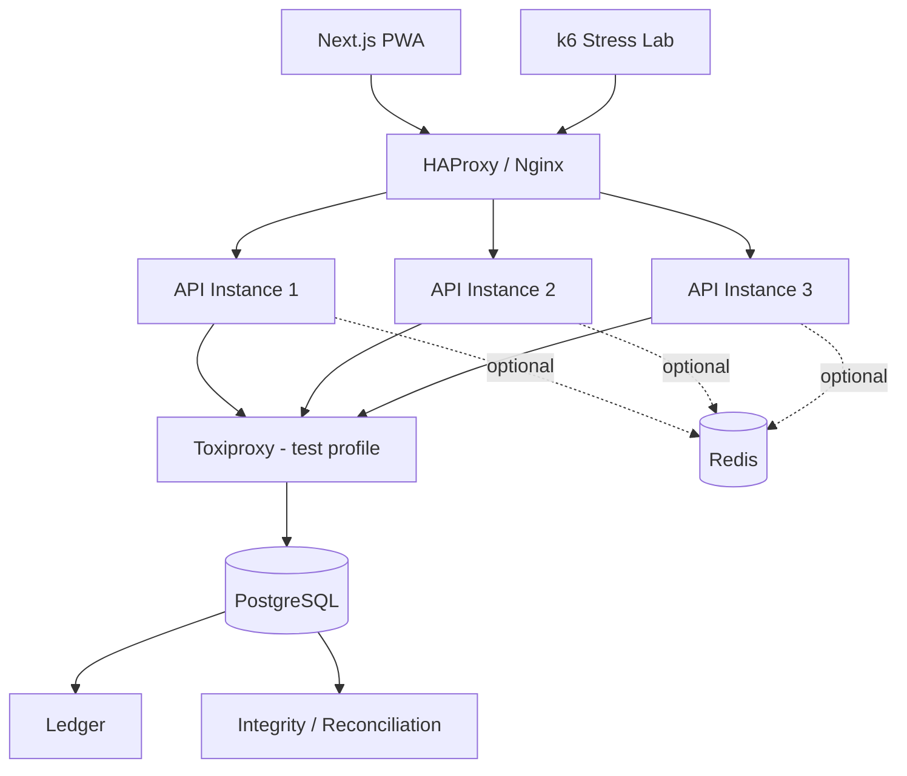

# What bKash, Nagad, M-PESA, and Large Payment Platforms Teach Us About Building a Trustworthy Money-Movement System

## Executive summary

The most important conclusion from looking at **bKash, Nagad, M-PESA, Mojaloop, large payment processors such as Juspay, and commercial banking reference architectures such as Temenos** is that reliability does **not** come from making every component distributed. It comes from being very deliberate about **which part is allowed to decide that money has moved**.

bKash is already operating at national scale: it reports more than **83 million customers, 350,000 agents, and 900,000 merchants as of April 2026**. Its public materials show multiple access channels—app, USSD, and payment gateway—and bKash has publicly highlighted its use of real-time/data-in-motion technology for secure and reliable services. However, bKash does **not publicly disclose enough detail about its transactional database topology, locking algorithms, or failover mechanisms** for us to honestly claim that it uses PostgreSQL, particular isolation levels, specific queue technologies, or a particular microservice design. citeturn0search8turn0search13turn1search1

Nagad similarly exposes nationwide service, customer, agent/distributor, and transaction-limit information publicly, but I could not find reliable primary documentation of its internal ledger/database/HA architecture. We should therefore learn from its **product constraints and national MFS context**, not invent an architecture and attribute it to Nagad. citeturn8search3turn8search6

M-PESA gives us considerably more public technical evidence. During a major platform migration, Huawei documented moving **12.8 million active M-PESA subscribers** onto a mobile-money platform designed for improved availability, faster transaction processing, real-time monitoring, third-party APIs, and carrier-grade security. Safaricom later reported **31.5 million active M-PESA users and KES 40.2 trillion in annual transaction value** for the year ending March 2024. citeturn7search2turn6search0

At the infrastructure level, large payment platforms repeatedly converge on the same themes: **multiple stateless application instances, health-checked load balancing, durable transactional state, multi-zone redundancy, controlled retries, idempotency, reconciliation, observability, and graceful degradation of noncritical subsystems**. Juspay, for example, describes multi-Region and multi-AZ deployment, active-active cell architecture, and 99.99% uptime while processing more than 175 million payments daily; AWS's Temenos reference architecture similarly uses load-balanced autoscaling compute, active-standby messaging, and Multi-AZ databases. citeturn6search2turn1search3

For **your six-hour hackathon**, the right interpretation is therefore:

> **Simulate the reliability properties of a national-scale MFS, not the infrastructure size of one.**

Your target architecture should be:

```text
3 stateless API replicas
        +
health-checked gateway
        +
1 authoritative PostgreSQL writer
        +
strict ACID transfer transaction
        +
idempotency
        +
row locks
        +
immutable ledger
        +
reconciliation
        +
k6 concurrency testing
        +
controlled failure injection
```

That directly addresses the actual challenge's demand for correctness under simultaneous activity, unexpected behavior, and future growth while respecting its instruction to build a **small, thoughtful closed-system product rather than an incomplete banking platform**. fileciteturn0file2

## What the large MFS and payment systems actually teach us

The useful lesson is not “bKash probably uses technology X.” It is identifying **observable requirements and publicly documented industry patterns**.

| System | Public scale / evidence | Reliability clues we can safely derive | What we should borrow |
|---|---|---|---|
| **bKash** | 83M+ customers, 350K+ agents, 900K+ merchants; app + USSD + payment gateway; real-time/data-in-motion work publicly recognized. citeturn0search8turn0search13turn1search1 | Multiple access channels, large integration surface, real-time operational/data processing, strong compliance emphasis. citeturn0search4turn0search13 | Channel independence, authoritative backend, transaction receipts/history, limits, monitoring |
| **Nagad** | Nationwide app plus entrepreneur/distributor network and transaction limits. citeturn8search3turn8search6 | Real MFS must apply operational limits and serve users through a broad physical/digital ecosystem. Internal HA details are not publicly documented in usable depth. | Explicit limits, clear errors, simple customer journey |
| **M-PESA** | 31.5M active users and KES 40.2T annual transactions in 2024; earlier platform migration documented 12.8M active users. citeturn6search0turn7search2 | Public architecture material explicitly emphasizes availability, faster transaction processing, real-time monitoring, APIs and financial-grade security. citeturn7search2 | Monitoring, multiple channels, resilient transactional core, strict receipts/status |
| **Mojaloop** | Open-source mobile-money interoperability platform with central ledger and transaction protocols. citeturn4search12turn4search22 | Transactions are designed to be unique/idempotent so retries do not duplicate money movement; Docker-based integration environments are part of the ecosystem. citeturn4search4turn4search3 | Idempotent transfer IDs, ledger thinking, test environment |
| **Juspay** | 175M+ payments/day, up to 50K TPS, 99.99% infrastructure uptime. citeturn6search2 | Multi-AZ, multi-Region, active-active cells, dynamic scaling and failover. citeturn6search2 | Stateless scale-out and failure isolation as future path |
| **Temenos banking reference architecture** | Commercial core banking/payment reference design. | Load balancer → autoscaling containers → active-standby messaging → Multi-AZ relational DB. citeturn1search3turn1search9 | Separate compute availability from data durability |
| **Stripe / PayPal APIs** | Mature large-scale payment APIs. | Explicit idempotency keys make retries safe after timeouts and uncertain responses. citeturn3search0turn3search5 | Idempotency header + stored response + request fingerprint |

### The architecture pattern behind all of this

A payment system fundamentally has two very different layers:

```text
                    ELASTIC LAYER
        easy to duplicate / restart / replace

            API    API    API    API
             │      │      │      │
             └──────┴──┬───┴──────┘
                       │
                       ▼

                 CONSISTENCY LAYER
       extremely careful about money state

              Transaction Engine
                       │
                       ▼
                Financial Ledger
                       │
                       ▼
              Durable Database
```

The **API layer should be disposable**.

The **financial state must not be**.

This is exactly why your idea of three Docker API containers is valuable.

### Multiple channels are not multiple ledgers

bKash exposes services through its app, USSD, and payment gateway, and M-PESA has similarly expanded beyond a single mobile interface. citeturn0search12turn0search13turn7search7

That does **not** mean each channel owns financial state.

Conceptually:

```text
Next.js PWA ──────┐
                  │
USSD ─────────────┼──► Money Movement Core ───► Ledger
                  │
Merchant API ─────┘
```

For your project there is only one channel—the PWA—but architecturally you should preserve the same rule:

> **The UI submits intentions. The backend determines financial truth.**

Never put authoritative balance logic in:

```text
React state
localStorage
service worker cache
Redis cache
API process memory
```

### Product availability and financial consistency are different goals

M-PESA's public platform documentation stresses availability and real-time monitoring; major payment architectures such as Juspay and Temenos add redundancy across compute and infrastructure layers. citeturn7search2turn6search2turn1search3

But when the authoritative financial database is unavailable, the correct behavior for your hackathon is **not**:

```text
"Keep transferring from cached balances."
```

It is:

```text
Financial core unavailable
          │
          ▼
Do NOT move money
          │
          ▼
503 SERVICE_UNAVAILABLE
          │
          ▼
Client retries later
with same idempotency key
```

For money, **correct-but-temporarily-unavailable is preferable to available-but-potentially-wrong**.

That distinction will be an excellent judge-facing engineering decision.

## How robust money systems survive failures

The most useful thing we can take from mature payment systems is the idea that failure is **normal**, so every failure point needs defined semantics.

### API server failure

Suppose your topology is:

```text
             HAProxy
                │
       ┌────────┼────────┐
       ▼        ▼        ▼
     API-1    API-2    API-3
       │        │        │
       └────────┼────────┘
                ▼
            PostgreSQL
```

Now API-2 dies.

```text
                 X
               API-2
```

The gateway stops routing new traffic to it.

API-1 and API-3 continue.

This is the same general compute-redundancy principle seen in multi-instance banking/payment reference architectures: frontends/load balancers distribute requests across replaceable compute instances while the durable data layer is treated separately. citeturn1search3turn6search2

The important subtlety is:

### **Do not let the load balancer blindly replay POST transfers.**

Instead the client owns the retry operation with the **same idempotency key**.

That is the approach explicitly documented by payment APIs such as PayPal and Stripe: callers retry uncertain requests using the same unique request identifier so the server can return the existing result instead of creating the operation again. citeturn3search0turn3search5

### Failure before the database transaction starts

```text
Client
  │
  ▼
API-2
  │
  X CRASH
```

Nothing happened.

Client retries:

```text
Idempotency-Key: 2e142...
```

Another API container handles it.

```text
API-1
  │
  ▼
PostgreSQL
  │
  ▼
Transfer completes
```

Fine.

### Failure after `BEGIN` but before `COMMIT`

Suppose:

```text
BEGIN

lock sender
debit sender

CRASH
```

The transaction never committed.

PostgreSQL transactions and locking are designed so row changes remain transactional; locks are held until commit/rollback, and incomplete work is not presented as committed financial state. citeturn2search5turn2search4

The client retries.

The operation starts cleanly again.

### The hardest case: server dies after commit but before sending the response

This is the real reason idempotency matters.

```text
API
 │
 ▼
BEGIN
 │
Debit Alice
Credit Bob
Write ledger
 │
COMMIT  ✓
 │
 X API crashes
 │
(no HTTP response)
```

The user sees:

```text
"Something went wrong."
```

But the money **did move**.

Without idempotency:

```text
retry
  ↓
another transfer
  ↓
DOUBLE DEBIT
```

With idempotency:

```text
retry same key
      │
      ▼
idempotency record exists
      │
      ▼
return original transfer
```

This is precisely the uncertainty problem that Stripe and PayPal use idempotency to address. citeturn3search0turn3search5

### Two simultaneous spend attempts

PostgreSQL's `FOR UPDATE` row lock prevents another transaction from concurrently modifying/locking that account row until the first transaction finishes. PostgreSQL also explicitly recommends acquiring locks on multiple objects in a consistent order to reduce deadlocks. citeturn2search5turn2search2

So:

```text
Alice = ৳100,000

API-1                       API-3
────────                    ────────

৳80k → Bob                  ৳80k → Carol

LOCK Alice
                             waits

balance = 100k

debit 80k

COMMIT

                             lock acquired
                             balance = 20k

                             REJECT:
                             insufficient funds
```

That is your MFS-grade concurrency story.

### Database outage

This needs a very different answer from API failure.

```text
API-1 ──┐
API-2 ──┼──► PostgreSQL  X
API-3 ──┘
```

All money-changing requests should fail:

```json
{
  "code": "FINANCIAL_CORE_UNAVAILABLE",
  "message": "Transfers are temporarily unavailable. No money has been moved."
}
```

Your **production evolution** would introduce database failover—commercial reference architectures commonly use Multi-AZ relational databases for exactly that availability requirement. citeturn1search3turn1search9

But do **not** try to implement a real distributed PostgreSQL failover cluster in a six-hour hackathon unless the entire money engine is already finished.

### Cache failure

Redis should not be essential to transferring money.

If:

```text
Redis X
```

you may lose:

```text
distributed rate limits
cached profile information
temporary analytics counters
```

but this must remain valid:

```text
Send Money
      │
      ▼
PostgreSQL transaction
      │
      ▼
Correct
```

That is graceful degradation.

A mature payment platform such as Juspay may use caching infrastructure extensively for performance and availability, but your financial truth should remain isolated from optional cache availability. citeturn6search2

## The architecture I would now recommend for your hackathon

I would slightly extend the architecture we already designed.



Toxiproxy is worth serious consideration. Shopify designed it specifically for development/test environments to simulate latency, broken connections, timeouts and related network conditions deterministically. citeturn9search0

That would turn your Docker environment from:

> “Look, we have three containers.”

into:

> **“We can deliberately break the network during a financial transaction and prove what the application does.”**

### Docker Compose

Conceptually:

```yaml
services:
  web:
    # Next.js PWA

  gateway:
    # HAProxy / Nginx

  api:
    # one backend image
    # docker compose can run several replicas

  postgres:
    # authoritative financial store

  redis:
    # optional / non-authoritative

  toxiproxy:
    # fault injection for DB/Redis links

  k6:
    # load and concurrency testing
```

Grafana documents an official Docker image for k6, and k6 is designed for load/stress testing of application reliability and performance. citeturn9search4turn9search9

You therefore get a proper:

```text
             MINI FINANCIAL LAB

         ┌─────────────────────┐
         │ normal traffic      │
         │ duplicate requests  │
         │ concurrent spends   │
         │ API crashes         │
         │ DB latency          │
         │ network disconnects │
         │ cache failure       │
         └──────────┬──────────┘
                    │
                    ▼
               Wallet System
                    │
                    ▼
              Integrity Check
                    │
                    ▼
                   PASS
```

### Don't put Toxiproxy in the normal data path during the judge demo unless needed

Run two profiles:

```text
docker compose up
```

Normal application.

And:

```text
docker compose --profile chaos up
```

Testing environment.

That keeps your normal demo stable.

## The failure laboratory I would build

This is where your project can feel dramatically more serious than everyone else's.

### Normal multi-instance load

```text
Gateway
 │
 ├─ API-1
 ├─ API-2
 └─ API-3
```

Run k6.

Show request distribution.

Then stop:

```text
API-2
```

Continue transferring across other seeded accounts.

Expected:

```text
Application-node failures: tolerated

Committed transfers lost: 0

Financial invariants broken: 0
```

The architectural principle matches the redundant compute used by large payment platforms and banking reference designs. citeturn6search2turn1search3

### Duplicate request storm

Stripe and PayPal both document idempotency specifically to make repeated/retried mutation requests safe. citeturn3search0turn3search7

Send:

```text
100 requests

POST /transfers

Idempotency-Key:
DEMO-TRANSFER-0001
```

Expected:

```text
HTTP attempts                100

Financial transfers           1

Ledger debit entries          1

Ledger credit entries         1

Money moved                 ৳500
```

Not:

```text
৳50,000
```

### Double-spend attack

Seed:

```text
Alice:
৳100,000
```

Launch concurrently:

```text
API-1:
Alice → Bob
৳80,000

API-3:
Alice → Carol
৳80,000
```

Expected:

```text
COMPLETED                   1

INSUFFICIENT_FUNDS          1

Alice                ৳20,000

negative balances           0
```

PostgreSQL row-level locks give you the primitive needed to serialize competing updates on the same account. citeturn2search5

### Deadlock pressure

Run many:

```text
Alice → Bob
Bob → Alice
```

Because you lock:

```text
min(account_id)
then
max(account_id)
```

you drastically reduce this deadlock pattern. PostgreSQL's own documentation recommends consistent lock acquisition order as a primary defense against deadlocks. citeturn2search2

Expected:

```text
corrupted transfers     0

ledger imbalance        0

negative balances       0
```

You should still handle PostgreSQL deadlock/serialization errors with a bounded transaction retry, because PostgreSQL may abort transactions when conflicts require it. citeturn2search2turn2search14

### Crash during money movement

Add a test-only injection point:

```text
FAIL_AFTER_DEBIT=true
```

Transaction:

```text
BEGIN

Debit Alice

throw exception

ROLLBACK
```

Expected:

```text
Alice unchanged
Bob unchanged

completed transfer absent

ledger entries absent
```

This demonstrates **Atomicity** much more convincingly than saying the word “ACID” on a slide.

### Network degradation

Toxiproxy can manipulate connections in test environments and simulate latency or connection failure. citeturn9search0

Inject:

```text
PostgreSQL latency:
2000 ms
```

The system should become slower.

It must **not** become financially incorrect.

Then simulate:

```text
DB connection unavailable
```

Expected response:

```text
503
FINANCIAL_CORE_UNAVAILABLE
```

And afterward:

```text
ledger imbalance    0
money lost          0
duplicates          0
```

That's real resilience testing.

## Features worth borrowing from national MFS products

National MFS reliability isn't only servers. There are several product-level safety patterns worth copying.

### Recipient verification before confirmation

M-PESA introduced “Hakikisha,” which lets users verify the intended recipient before finalizing money movement. citeturn7search5

You should absolutely borrow the underlying idea.

Before send:

```text
You are sending

৳25,000

to

SALMAN RAHMAN
017•••••432

[Cancel]

[Confirm ৳25,000]
```

This solves an entirely different problem from ACID:

```text
Computer correctness
vs
Human correctness
```

Your server can perfectly transfer money to the **wrong person**.

Recipient confirmation is therefore one of the highest-value low-effort features you can add.

### Transaction receipts

bKash provides transaction-related app functionality and explicitly exposes transaction history/receipts in services such as Group Send Money; MFS services depend heavily on giving users a clear record of what happened. citeturn0search10turn0search14

Your receipt should show:

```text
✓ Money Sent

৳2,500.00

Recipient
Salman Rahman

Status
Completed

Transaction ID
TX-01K...

Date
29 Aug 2026, 12:43 PM
```

The `transactionId` becomes critical when:

```text
customer asks support
request timed out
user disputes transfer
reconciliation is required
```

### Multiple network conditions

Both bKash and M-PESA support more than a single rich-app channel; bKash exposes USSD, while M-PESA has also invested in offline-oriented app experiences. citeturn0search13turn7search9

For your PWA, I would **not** attempt fully offline money transfers.

Instead:

```text
Online:
send enabled


Offline:
last-known information readable

balance:
"Last updated 12:42 PM"


Send Money:
disabled

"Reconnect to securely send money."
```

That's actually safer.

### Explicit limits

National payment ecosystems enforce transaction limits and rules, and Nagad publicly exposes transaction limits/charges while Bangladesh Bank formally regulates domestic MFS categories. citeturn8search6turn5search3

You could define simple hackathon limits:

```text
amount > 0

amount <= ৳100,000

daily send total <= ৳200,000
```

The exact fake-money values are your product decision.

The architectural idea is what's important:

```text
Policy layer
    │
    ▼
Transfer engine
```

not random validation scattered across controllers.

### Real-time monitoring

M-PESA's publicly documented platform migration called out **real-time system monitoring**, while bKash has publicly highlighted real-time/data-in-motion technology used in secure and reliable services. citeturn7search2turn1search1

That strongly reinforces our earlier idea of a judge-facing **System Integrity Dashboard**.

But it should show actual DB-derived metrics:

```text
SYSTEM HEALTH

API replicas
3 / 3 healthy

Completed transfers
15,284

Idempotent replays
684

Rejected overspend attempts
72


FINANCIAL INTEGRITY

Negative accounts
0

Unbalanced transactions
0

Transfers missing journals
0

Issued funds
৳5,000,000

Current wallet balances
৳5,000,000

Difference
৳0

STATUS
HEALTHY
```

That's probably more valuable for this hackathon than three additional customer-facing screens.

## What we should deliberately not copy

Large MFS platforms have years of development, enormous operational teams, compliance departments, infrastructure budgets, and mature integration ecosystems. bKash's current national footprint alone is tens of millions of customers and hundreds of thousands of agents/merchants; M-PESA processes money at a scale far beyond a hackathon prototype. citeturn0search8turn6search0

Trying to imitate their deployment size would actively harm your project.

### Don't build microservices

Mojaloop is composed of multiple services for interoperability, clearing, settlement, account lookup and related scheme-level responsibilities. citeturn4search3turn4search22

You don't have those problems.

Your scope is:

```text
ONE closed wallet ecosystem
```

So:

```text
modular monolith
```

wins.

### Don't build Kafka

Mojaloop uses asynchronous components because it coordinates multiple financial institutions and settlement processes. citeturn4search3

Your:

```text
Alice → Bob
```

lives entirely inside one database.

Make it synchronous and atomic.

Later, asynchronous events can support:

```text
notifications
analytics
emails
fraud processing
```

but never make Kafka necessary for the core wallet balance transfer during this hackathon.

### Don't make Redis your money database

No.

### Don't fake active-active databases

Juspay's active-active/cell architecture makes sense at its publicly documented scale and availability targets. citeturn6search2

Attempting:

```text
Postgres A
       ↕
Postgres B
```

with pretend multimaster behavior will create more problems than it solves.

For the hackathon:

```text
one authoritative PostgreSQL
```

is excellent.

For production:

```text
Primary
   │
synchronous / managed standby
   │
automatic failover
```

is the sensible next step.

### Don't claim “10 million-user scalability”

Say:

> **“Our prototype demonstrates the architectural property required for horizontal scaling: the application layer is stateless and can run multiple instances without changing financial correctness.”**

That's accurate.

You can then cite commercial examples where similar separation between scalable compute and resilient persistent infrastructure is used at much larger scale. citeturn6search2turn1search3

## The judge-facing story this research gives you

Your presentation should not imply:

> “We built bKash in six hours.”

That would be silly.

Your argument should be:

> **“We studied the reliability properties visible in national-scale MFS and payment infrastructure, then reproduced the important ones at prototype scale.”**

Then show this:

```text
                    NATIONAL MFS PRINCIPLE

                     Redundant channels
                           │
                           ▼
                     Reliable APIs
                           │
                           ▼
                   Transaction authority
                           │
                           ▼
                       Ledger
                           │
                           ▼
                  Audit + Monitoring
                           │
                           ▼
                    Reconciliation
```

Your implementation becomes:

```text
                     OUR HACKATHON

                      Next.js PWA
                           │
                           ▼
                        HAProxy
                           │
                ┌──────────┼──────────┐
                ▼          ▼          ▼
              API-1      API-2      API-3
                │          │          │
                └──────────┼──────────┘
                           ▼
                      PostgreSQL
                           │
             ┌─────────────┼──────────────┐
             ▼             ▼              ▼
          Account       Transfer        Ledger
                                         │
                                         ▼
                                  Reconciliation

             k6 + Docker + Toxiproxy
                      │
                      ▼
                FAILURE PROOF
```

Then you physically demonstrate:

**Normal transfer**

```text
Alice → Bob
৳2,500
```

**Duplicate network retry**

```text
100 requests
same idempotency key

→ 1 financial transfer
```

**Concurrent double spend**

```text
৳80k + ৳80k
against ৳100k

→ only one succeeds
```

**API server failure**

```text
kill API-2

→ system keeps serving
```

**Atomicity**

```text
inject failure after debit

→ neither account changes
```

**Database/network failure**

```text
disconnect Postgres

→ money transfer fails closed
→ nothing is corrupted
```

**Final reconciliation**

```text
Negative balances        0

Duplicate transfers      0

Unbalanced journals      0

Money discrepancy        ৳0

INTEGRITY                 PASS
```

That is very close to what the challenge is asking you to demonstrate: not a huge feature catalogue, but a small money application designed from both the **user's perspective and the engineer's responsibility to make it trustworthy**, including concurrent activity, unreliable conditions and future growth. fileciteturn0file2

The strongest lesson from bKash, M-PESA, Mojaloop, Stripe/PayPal-style APIs, and commercial banking infrastructure is therefore not a particular framework or cloud product. It is a hierarchy of priorities:

```text
             MONEY MUST BE CORRECT
                      │
                      ▼
             MONEY MUST MOVE ONCE
                      │
                      ▼
        FAILURE MUST HAVE DEFINED SEMANTICS
                      │
                      ▼
        HISTORY MUST BE EXPLAINABLE/AUDITABLE
                      │
                      ▼
        COMPUTE MUST BE REPLACEABLE/SCALABLE
                      │
                      ▼
       OPTIONAL COMPONENTS MAY DEGRADE SAFELY
                      │
                      ▼
              THEN OPTIMIZE SPEED
```

For this hackathon, **that philosophy is far more valuable than trying to reproduce the actual infrastructure of bKash or Nagad**.